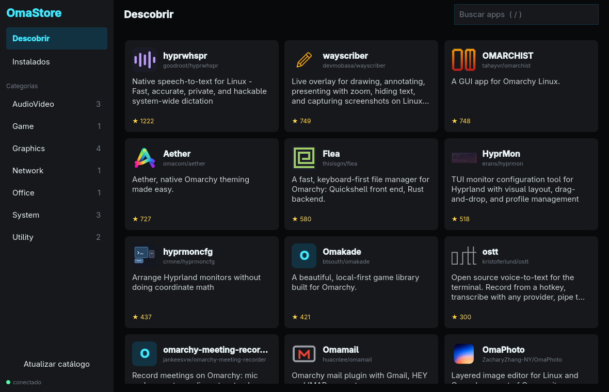
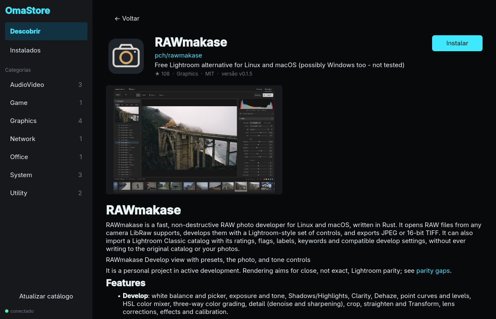

# OmaStore

Loja de aplicativos para o [Omarchy](https://omarchy.org). A OmaStore encontra
apps publicados no GitHub, mostra descrição, ícone e screenshots tirados do
próprio repositório e instala o binário da última release com um clique, no
seu `$HOME`, sem `sudo`, gerando o atalho no menu (`.desktop`).





## Como funciona

- **Descoberta:** só entram repositórios de **apps** com um `omastore.toml`
  na raiz (plugins e temas ficam de fora). Eles são achados pela busca de
  código do GitHub, pelo topic `omarchy` e por listas curadas. Para ser
  instalável, a última release precisa ter um binário para Linux.
- **Sem reprocessamento:** um banco SQLite guarda o estado de cada
  repositório; com requisições condicionais (ETag), uma nova indexação só
  reprocessa o que mudou no GitHub.
- **Instalação segura:**
  - o checksum é conferido (o `digest` da API do GitHub, ou `*.sha256`/`checksums.txt`);
  - a extração é protegida contra *path traversal* e symlinks maliciosos;
  - nada do pacote é executado durante a instalação;
  - a instalação é desfeita por completo se algo falhar no meio;
  - nunca sobrescreve arquivos que não sejam da loja nem encobre comandos do
    sistema.
- **Onde os apps ficam:**
  - binários em `~/.local/share/omastore/apps/<owner>__<repo>/<versão>/`;
  - lançador em `~/.local/bin/`;
  - ícone no tema `hicolor` do usuário;
  - atalho em `~/.local/share/applications/omastore-<owner>-<repo>.desktop`.
- **Visual:** segue as cores do tema ativo do Omarchy e muda junto quando você
  troca de tema.

## Instalação

Arch/Omarchy, binário pré-compilado (a partir da primeira release):

```sh
# baixe o PKGBUILD anexado à release mais recente e:
makepkg -si
```

Ou compilando do código:

```sh
git clone https://github.com/KitsuneSemCalda/OmaStore
cd OmaStore/packaging/arch
makepkg -si
systemctl --user enable --now omastored.socket       # opcional: daemon sob demanda
systemctl --user enable --now omastore-index.timer   # opcional: catálogo diário + aviso de atualizações
```

Com o socket do systemd, o daemon sobe na primeira conexão e encerra sozinho
depois de 10 minutos ocioso. O timer atualiza o catálogo uma vez por dia e
mostra uma notificação quando há versões novas dos apps instalados; nada é
instalado sem você pedir.

Sem o systemd, a interface inicia o daemon sozinha quando precisa.

Recomendado: `gh auth login` (ou `export GITHUB_TOKEN=...`). Sem token, o
GitHub limita a 60 requisições por hora, o que não basta para indexar o
catálogo inteiro.

## Uso

Interface: abra **OmaStore** no menu ou rode `omastore-gui`.

| Atalho | Ação |
|---|---|
| `/` | buscar |
| `Esc` | voltar |
| `Ctrl+R` | atualizar o catálogo |
| setas + `Enter` | navegar e abrir um app |

`omastore-gui --open owner/repo` abre direto a página de um app.

Linha de comando (mesmo backend, sem interface):

```sh
omastore index                  # atualiza o catálogo
omastore list --category Graphics
omastore show pch/rawmakase
omastore install pch/rawmakase
omastore update                 # atualiza todos os apps instalados
omastore update --check         # só lista o que tem versão nova
omastore uninstall pch/rawmakase
```

## Arquitetura

```
omastore-gui (C++/Qt Quick)  ── JSON-RPC 2.0 / socket Unix ──▶  omastored (Go)
  só apresentação                                                 indexador, cache SQLite,
                                                                  instalador, cache de imagens
```

- `backend/` — Go: `internal/{github,gitrepo,index,store,install,imagecache,rpc}`,
  daemon em `cmd/omastored`, CLI em `cmd/omastore`.
- `frontend/` — Qt 6 / QML: cliente IPC, modelos e telas. O frontend não
  acessa a rede; tudo passa pelo daemon.
- Protocolo IPC: [`docs/ipc.md`](docs/ipc.md).
- Ideias em discussão: [`docs/ideas/`](docs/ideas/README.md).

## Para autores de apps

Quer seu app na loja? Veja [`docs/autores.md`](docs/autores.md): topic
`omarchy`, nomes de assets, ícone, screenshots e checksums.

## Desenvolvimento

Requisitos: Go 1.26+, um compilador C (CGO, para o SQLite), Qt 6.5+
(`qt6-base`, `qt6-declarative`, `qt6-svg`), CMake e Ninja.

```sh
make            # compila tudo (bin/ e frontend/build/)
make check      # gofmt + vet + testes do backend
make test       # todos os testes (backend e frontend)
make run-gui    # abre a interface usando o daemon de bin/
make help       # lista todos os alvos
```

Os testes não acessam a rede: a API do GitHub é simulada com `httptest` e o
daemon com um servidor falso em `QLocalServer`.

## Licença

MIT — veja [LICENSE](LICENSE).
