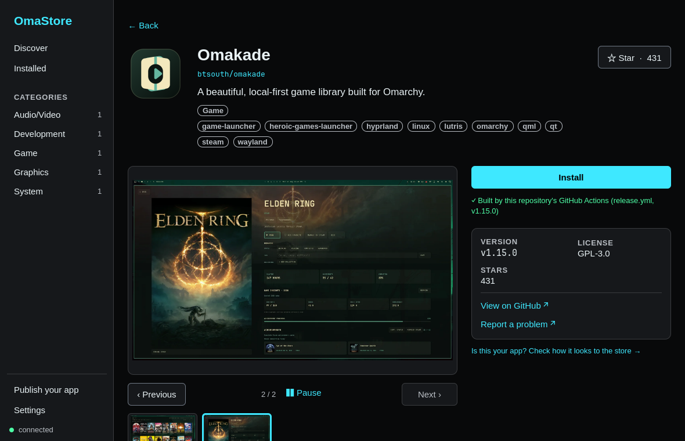
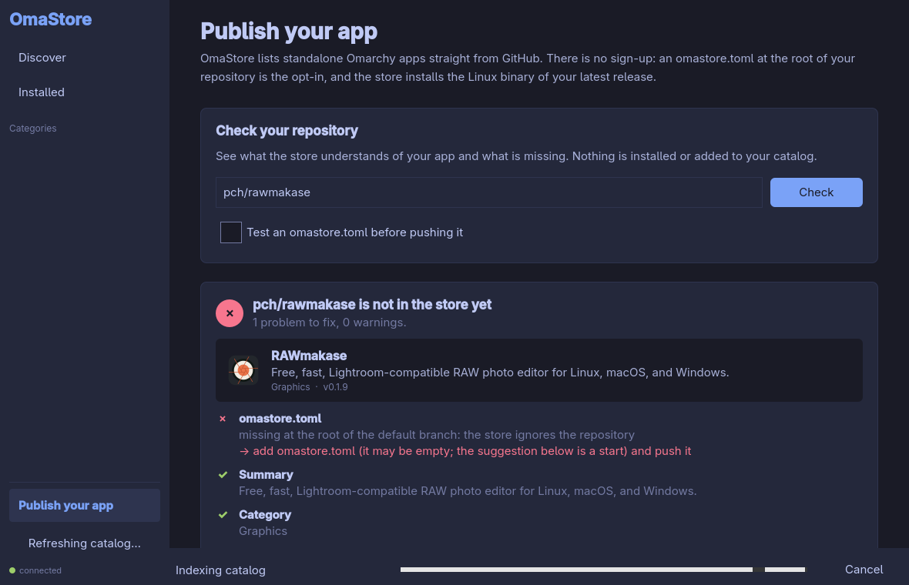

<p align="center"></p>

<h1 align="center">OmaStore</h1>

<p align="center">Standalone apps for Omarchy, all in one place.</p>

<p align="center">
  <a href="https://github.com/KitsuneForgering/OmaStore/actions/workflows/ci.yml"></a>
  <a href="https://github.com/KitsuneForgering/OmaStore/releases/latest"></a>
  <a href="LICENSE"></a>
  
</p>

<p align="center"><a href="#installation">Install</a> · <a href="#for-app-authors">Publish an app</a> · <a href="#how-it-works">How it works</a></p>

OmaStore is an app store for [Omarchy](https://omarchy.org).
It shows what each app does, installs the GitHub release into your account and
creates the menu shortcut. You can also update and remove apps from the
interface or the command line, without `sudo`. When an app declares system
packages in a `PKGBUILD`, the store can install them with pacman for you
(it asks for your password first).

<p align="center"></p>

| Discover | See the details before installing |
|---|---|
|  |  |

> **Early days:** apps get into the catalog when their authors publish an
> `omastore.toml`, so the catalog is still small. [See how to publish an app](docs/authors.md).

## Why use it

- **Discover community apps:** find projects with descriptions, images,
  categories and search in one place. App pages render the README and root
  `CHANGELOG.md` with working repository links.
- **Install without touching the system:** apps live in your account, with menu
  shortcuts, and can be removed from the store.
- **An intact download:** the file is checked against GitHub's digest or the
  release's published checksum. A file with neither is installed only after you
  confirm it (in the interface, or with `--allow-unverified` in the CLI), and
  that holds for updates too. A checksum from the release itself proves the
  download arrived intact, not who built it.
- **Updates you can undo:** an update keeps the version it replaced, so an app
  that is open keeps working and **Go back** returns to the previous version
  without downloading anything. The app detail shows its install, update and
  rollback history. An app is not removed while it is running unless you insist.
- **The whole app, not only the binary:** the `depends` and `optdepends` of the
  app's `PKGBUILD`, and the shared libraries its installed executable needs and
  your system lacks (read from the file, never run), are listed on its page; the
  missing ones that the pacman repositories have are installed with one click
  (AUR packages are never installed for you).
- **Like it? Star it:** the star button on an app's page stars its repository
  on GitHub (with `gh auth login` or `GITHUB_TOKEN`).

## How it works

- **Discovery:** only **app** repositories with an `omastore.toml` at the root
  get in (plugins and themes are left out). They are found through GitHub
  code search, the `omarchy` topic and curated lists. To be
  installable, the latest release must have a Linux binary. Topic discovery
  keeps its stars-ranked results and adds up to two pushed-date searches (the
  last 30 days and days 31–180), one page each. Extra topic searches are capped
  at five per refresh; their logs report returned and newly found candidates.
  GitHub search is bounded, so this improves coverage without claiming to find
  every repository with the topic.
- **App downloads:** the manifest selects a file by name from the repository's
  latest stable GitHub release. OmaStore downloads the binary from that release,
  not from a URL in the manifest or README. Icons and screenshots are fetched
  separately from the repository or the HTTPS URLs declared for display.
- **No reprocessing:** an SQLite database keeps the state of each
  repository; with conditional requests (ETag), a new indexing run only
  reprocesses what changed on GitHub (a new push, a new release, or files
  replaced or added in the same release).
- **Live catalog:** apps show up in the interface as they are indexed, and the
  jobs bar shows the current stage (discovery, state check, indexing). Discovery
  queries its sources in parallel and gives up on a source that does not answer
  within 2 minutes (`omastore index --search-timeout`); the run then keeps the
  apps already stored instead of pruning them.
- **Safe installation:**
  - the GitHub API `digest` or a published `*.sha256`/`checksums.txt` is checked;
    a file with neither needs your confirmation (`--allow-unverified` in the CLI);
  - extraction is protected against *path traversal* and malicious symlinks;
  - nothing from the package is executed during installation;
  - the installation is fully undone if something fails midway;
  - it never overwrites files that do not belong to the store nor shadows system
    commands;
  - the app itself never needs root. The one exception is its system
    dependencies, installed only when you accept: `pkexec pacman -S --needed`
    with package names validated and resolved by pacman, from the configured
    repositories only.
- **Where apps live:**
  - binaries in `~/.local/share/omastore/apps/<owner>__<repo>/<version>/`;
  - tracked launcher in `~/.local/bin/`, removed on uninstall only while it is
    still OmaStore's launcher for that app;
  - icon in the user's `hicolor` theme;
  - shortcut in `~/.local/share/applications/omastore-<owner>-<repo>.desktop`.
- **Look:** follows the active Omarchy theme's colors and typography, and updates
  when you switch themes.

## Installation

On Arch/Omarchy, without `sudo`:

```sh
curl -fsSLO https://github.com/KitsuneForgering/OmaStore/releases/latest/download/install.sh
sh install.sh
```

For a one-line install with `curl` failure propagated by Bash:

```sh
bash -o pipefail -c 'curl -fsSL https://github.com/KitsuneForgering/OmaStore/releases/latest/download/install.sh | bash'
```

The script downloads the latest stable release for Linux x86_64, checks the SHA-256
published alongside the tarball and installs the three executables into a folder in your
account, with shortcuts in `~/.local/bin` and in the menu. It requires `curl`, `tar`,
`sha256sum` and the Qt 6 libraries (`qt6-base`, `qt6-declarative`, `qt6-svg`).
The script also copies the [skills for app authors](skills/README.md) into the
skills directory of each coding agent you have, the same ones Omarchy uses
(`~/.agents/skills` for OpenCode, Copilot, Gemini, Cursor, Crush and others, plus
Claude Code, Codex, Pi and Hermes). Your agent can then write your
`omastore.toml`, set up releases and audit your app with the store itself.
Skills of the same name that you already have are left untouched; pass
`--no-skills` to skip this step.
On Omarchy, it also adds a hook to `~/.config/omarchy/hooks/post-update.d/`, so
`omarchy-update` tells you when your OmaStore apps have updates; pass
`--no-hooks` to skip it. With the pacman package, link it yourself:
`ln -s /usr/share/omastore/omarchy/omastore.hook ~/.config/omarchy/hooks/post-update.d/`.
The two-step commands let you inspect `install.sh` before running it.
The SHA-256 check covers the release tarball; it does not verify `install.sh` itself.
OmaStore updates itself: when a new release is out, the sidebar offers
**Update OmaStore** and then **Restart OmaStore** (or run `omastore self-update`).
The release is checked against its published SHA-256 before anything changes,
and a failed update leaves the current version as it was. Running the same
script again also works. To remove
it, including the skills and the hook it added (the catalog and the apps installed through
OmaStore are kept):

```sh
sh install.sh --uninstall
```

`make uninstall` (with or without `sudo`) also runs this for the user who invoked
it, besides removing a `make install` from `/usr/local`.

If you prefer to manage the application with pacman, download the `PKGBUILD`
attached to the [latest release](https://github.com/KitsuneForgering/OmaStore/releases/latest)
(package `omastore-bin`) and run:

```sh
makepkg -si
```

### Building from source

To test unreleased changes, build a local tarball and install it with the same
script. It requires Go, a C compiler, CMake, Ninja and Qt 6 (see
[Development](#development)):

```sh
git clone https://github.com/KitsuneForgering/OmaStore
cd OmaStore
make dist VERSION=v0.1.1-dev
sh packaging/install.sh dist/omastore-0.1.1-dev-x86_64-linux.tar.gz
```

Or with pacman, building the `omastore-git` package from `master`:

```sh
git clone https://github.com/KitsuneForgering/OmaStore
cd OmaStore/packaging/arch
makepkg -si
systemctl --user enable --now omastored.socket       # optional: on-demand daemon
systemctl --user enable --now omastore-index.timer   # optional: daily catalog + update notifications
```

With the systemd socket, the daemon starts on the first connection and exits on its own
after 10 idle minutes. The timer refreshes the catalog once a day and
shows a notification when there are new versions of the installed apps; nothing is
installed without you asking.

Without systemd, the interface starts the daemon on its own when needed.

`make release && sudo make install` (default `PREFIX=/usr/local`) also works over
an older installation that is running: it reloads your systemd user units, stops
the `omastored` still running the replaced binary (it would keep serving the old
version; the new one starts on the next connection) and tells you when a per-user
installation from `install.sh` in `~/.local` comes first in `PATH` and the menu.
The units point at the binaries under `PREFIX`.

Recommended: `gh auth login` (or `export GITHUB_TOKEN=...`). Without a token,
GitHub limits you to 60 requests per hour, which is not enough to index the
whole catalog.

## Usage

Interface: open **OmaStore** from the menu or run `omastore-gui`.

| Shortcut | Action |
|---|---|
| `/` | search |
| `Esc` | go back |
| `Ctrl+R` | refresh the catalog |
| arrows + `Enter` | navigate and open an app |

`omastore-gui --open owner/repo` opens an app's page directly;
`omastore-gui --check owner/repo` opens the page for app authors and checks
that repository.

Command line (same backend, no interface):

```sh
omastore index                  # refreshes the catalog (shows the stage while it runs)
omastore list --category Graphics
omastore show pch/rawmakase
omastore install pch/rawmakase
omastore update                 # updates all installed apps
omastore update --check         # only lists what has a new version (OmaStore's own too)
omastore self-update            # updates OmaStore itself (installations made by install.sh)
omastore rollback pch/rawmakase # back to the version the last update replaced
omastore uninstall pch/rawmakase # refuses while it runs; --force removes it anyway
omastore check pch/rawmakase    # for authors: what the store sees and what to fix
omastore deps pch/rawmakase     # system dependencies from its PKGBUILD; --install installs them
omastore star pch/rawmakase     # star it on GitHub (unstar removes the star)
```

## Architecture

```
omastore-gui (C++/Qt Quick)  ── JSON-RPC 2.0 / Unix socket ──▶  omastored (Go)
  presentation only                                               indexer, SQLite cache,
                                                                  installer, image cache
```

- `backend/` — Go: `internal/{github,gitrepo,index,asset,store,install,imagecache,search,rpc}`,
  daemon in `cmd/omastored`, CLI in `cmd/omastore`.
- `frontend/` — Qt 6 / QML: IPC client, models and screens. The frontend does not
  access the network; everything goes through the daemon.
- IPC protocol: [`docs/ipc.md`](docs/ipc.md).
- Ideas under discussion: [`docs/ideas/`](docs/ideas/README.md).

## For app authors

Want your app in the store? Open **Publish your app** in the sidebar (or run
`omastore check owner/repo`): it shows how the store sees your repository, what
blocks it and a ready-to-commit `omastore.toml` built from your release. Nothing is
installed and your catalog is not changed.



The full rules (asset names, icon, screenshots, checksums) are in
[`docs/authors.md`](docs/authors.md).

## Development

Requirements: Go 1.26+, a C compiler (CGO, for SQLite), Qt 6.5+
(`qt6-base`, `qt6-declarative`, `qt6-svg`; `qt6-tools` for the translations),
CMake and Ninja.

```sh
make            # builds everything (bin/ and frontend/build/)
make check      # gofmt + vet + backend tests
make test       # all tests (backend and frontend)
make run-gui    # opens the interface using the daemon from bin/
make help       # lists all targets
```

The tests do not access the network: the GitHub API is simulated with `httptest` and the
daemon with a fake server in `QLocalServer`. The Qt tests cover theme parsing,
fallback colors and live reload. A UI test checks the detail page's layout at
narrow and wide sizes, carousel navigation (buttons, thumbnails, arrow keys and
switching apps) and that text and buttons use the theme colors, with one sample
dark and one sample light theme. It does not cover every Omarchy theme or perform
pixel-level screenshot comparisons; the screenshots above are examples of the interface.

## Contributing

Bug reports, ideas and pull requests are welcome: see
[CONTRIBUTING.md](CONTRIBUTING.md) for the setup and the rules reviews check,
and [CHANGELOG.md](CHANGELOG.md) for what changed in each release. Please
report security problems privately, as described in [SECURITY.md](SECURITY.md).

## License

MIT — see [LICENSE](LICENSE).
